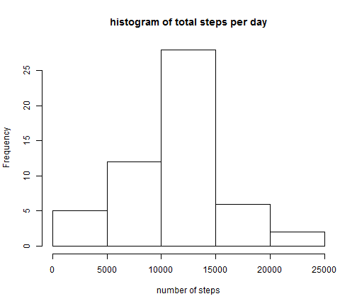
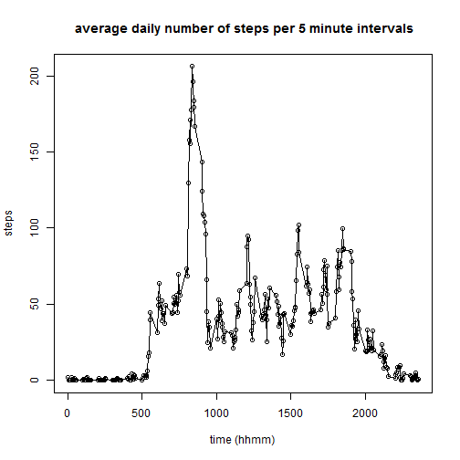
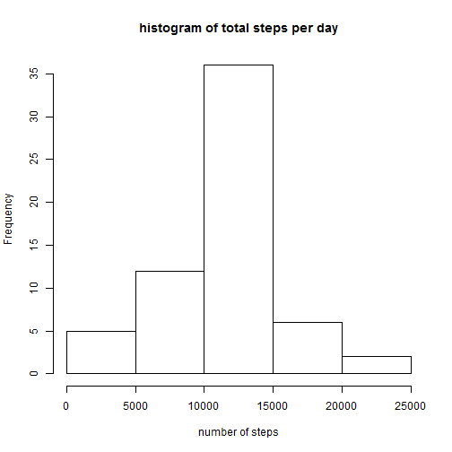
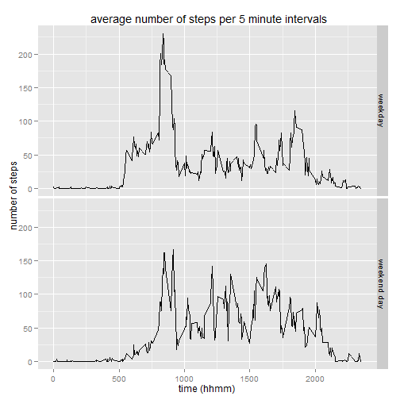

Assignment 1 of Coursera course reproducible research
=======================================================

## introduction 

This assignment makes use of data from a personal activity monitoring device. This device collects data at 5 minute intervals throughout the day. The data consists of two months of data from an anonymous individual collected during the months of October and November, 2012 and include the number of steps taken in 5 minute intervals each day. The activity monitoring data are available from [download](https://d396qusza40orc.cloudfront.net/repdata%2Fdata%2Factivity.zip).
This dataset contains the variables number of steps, date, and interval.

## reading the data

the following code chunk sets the working directory and reads the data


```r
setwd("C:/Users/Arthur/Desktop/CourseraR/exploratory/repdata_data_activity")
activity <- read.csv ( "activity.csv", sep = ",", header = TRUE)
```

## number of steps

the total number of steps taken per day ignoring missing values is as shown in the following figure  


```r
agg <- aggregate (steps ~ date, data = activity, sum)
hist (agg$steps, xlab = "number of steps", main = "histogram of total steps per day") 
```

 

calculating the mean and median number of total steps per day with this code:  


```r
mea <- mean (agg$steps, na.rm = T)
med <- median (agg$steps, na.rm = T)
```

the mean and median number of total steps per day are 1.0766189 &times; 10<sup>4</sup>and 10765, respectively. 


## the average daily activity pattern

the following code calculates the average daily number of steps. the resulting figure shows a pattern of walking activity during day time and absent activity at night. A peak in activity is seen around 8h in the morning. 


```r
agg02 <- aggregate (steps ~ interval, data = activity, mean)
plot (agg02, xlab = "time (hhmm)",  main = " average daily number of steps per 5 minute intervals")
lines (agg02)
```

 

the interval on average across days with the maximum number of steps is around 8h 30-35 min as calculated by following:


```r
waarde <- max (agg02$steps)
use <- agg02$steps == waarde
subagg02 <- agg02 [use,]
subagg02[,1]
```

```
## [1] 835
```

the total number of missing values is given by the following code chunk:


```r
navector <- is.na (activity$steps)
navector02 <- navector[navector == TRUE]
length (navector02)
```

```
## [1] 2304
```

## imputing NAs

the strategy for imputing missing values is to replace NAs in the steps variable with the average number of steps for that interval over all dates. the resulting imputed dataset is named activity02:


```r
activity02 <- activity
repmean02 <- rep (agg02$steps, times = 61)
for (i in 1: 17568) {
if (navector[i] == TRUE) {activity02$steps [i] <- repmean02[i] 
}}
```

the following code plots a histogram of the total number of steps taken each day, and calculates mean and median:


```r
aggimp <- aggregate (steps ~ date, data = activity02, sum)
hist (aggimp$steps, xlab = "number of steps", main = "histogram of total steps per day")
```

 

```r
mean (aggimp$steps)
```

```
## [1] 10766.19
```

```r
median (aggimp$steps)
```

```
## [1] 10766.19
```

after imputing, the median but not the mean is different. The new median is now closer to mean. In fact by coincidence the new median is exactly equal to the mean in the imputed dataset.

## differences in patterns between weekdays and weekend

The dates variable is a factor with the number of levels equal to the number of dates. The following code creates a new factor variable for each of the 7 weekdays and another factor variable for weekdays versus weekend days (2 levels). The new variables are added to the previously imputed dataframe resulting in dataframe activity03.


```r
days <- strptime (activity02$date, format = "%Y-%m-%d" )
days2 <- weekdays (days, abbreviate = FALSE)
days3 <- as.factor (days2)
days4 <- days3
levels (days4) <- c ("weekday", "weekday", "weekday", "weekday", "weekday", "weekend day", "weekend day")
activity03 <- cbind (activity02, days3, days4)
```

the differences in activity patterns between weekdays and weekend days can be analysed by aggregating per interval and per new factor variable days4 and taking the average number of steps. A plot of mean number of steps per interval for weekdays and weekend days shows different average activity patterns:


```r
library (ggplot2)
```

```
## Warning: package 'ggplot2' was built under R version 3.0.3
```

```r
aggactivity04 <- aggregate (activity03$steps, by = list (interval = activity03$interval, days = activity03$days4 ), FUN = mean)
qplot (interval,x, data = aggactivity04, ylab = " number of steps", xlab = "time (hhmm)" , main = " average number of steps per 5 minute intervals",  facets = days ~ ., type = "1", geom = "line")
```

 

The figure shows:

- weekday activity on average starts and ends earlier than weekend day activity)

- higher levels of stepping activity during weekend daytime than week day daytime 
